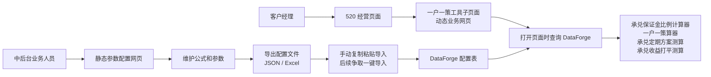

# 一户一策工具箱上线方案汇报

## 一、背景

目前一户一策工具箱 demo 中包含 6 个功能 tab：

- 承兑保证金比例计算器
- 一户一策算器
- 承兑定期方案测算
- 承兑收益打平测算
- 使用统计
- 参数配置

经会议讨论，后续上线时不再按原 demo 的 6 个 tab 整体上线，而是按使用对象和系统接入方式进行拆分：

- 前 4 个计算/测算功能合并为一个面向客户经理使用的动态业务网页；
- “参数配置”功能拆分为面向中后台业务人员使用的静态配置网页；
- “使用统计”功能不纳入本次页面建设范围，后续由专门人员在 WA 系统侧出具数据报告，并通过 DBA 支持完成相关数据处理。

整体方案已经明确，后续主要由我推进页面开发、规范适配和相关对接事项，中间涉及 DataForge 配置结构、配置导入方式、行内前端规范和离线测试方式等内容，需要继续与相关同事确认。

## 二、整体方案

本次建设采用“动态业务网页 + 静态配置网页”分离的方式推进。

面向客户经理的动态业务网页，将整合原工具箱中的 4 个计算/测算功能：

- 承兑保证金比例计算器
- 一户一策算器
- 承兑定期方案测算
- 承兑收益打平测算

该页面后续计划挂载在 520 经营大页面下，作为其中的一个子页面。客户经理打开页面时，页面需要从 DataForge 查询最新配置信息，并基于配置完成相关计算和测算。因此，该页面需要按照行内前端规范开发，并在代码完成后提交文俊审核，审核通过后再进行上线。

面向中后台业务人员的静态配置网页，主要对应原 demo 中的“参数配置”功能。业务人员可通过该页面维护公式和参数，并导出配置文件。配置文件形式暂定为 JSON 或 Excel，具体格式需结合 DataForge 导入方式，与向可、梁辰进一步确认。

静态配置网页不涉及行内系统接入，因此实现方式相对灵活，可以优先围绕配置维护、配置校验、文件导出等核心功能推进。

## 三、静态与动态网页分离逻辑

整体逻辑是：中后台业务人员通过静态配置网页维护公式和参数，并将配置导入 DataForge；客户经理侧使用的动态业务网页上线至 520 经营页面下，运行时从 DataForge 读取配置，确保计算和测算逻辑可配置、可维护，同时客户经理侧使用入口保持统一。

这种拆分方式可以将“配置维护”和“业务使用”分开处理：配置侧便于中后台人员维护和调整，业务侧则统一面向客户经理提供计算和测算能力。

## 四、后续推进事项

1. 确认 DataForge 配置结构

   需要向可、梁辰协助确认配置在 DataForge 中的存储结构，包括 key-value 形式、字段设计、公式和参数的区分方式等。该部分会影响动态业务网页的读取逻辑，也会影响静态配置网页的导出结构。

2. 确认配置文件导出格式

   静态配置网页可支持导出 JSON 或 Excel，最终格式需结合 DataForge 导入便利性确定。目前导入方式可能以复制粘贴为主，后续希望争取支持一键导入，该部分需要继续和向可沟通。

3. 开发静态配置网页

   静态配置网页不涉及行内系统，可先按配置维护和文件导出的需求推进开发。重点包括公式和参数维护、配置文件生成、配置内容检查等能力。

4. 开发动态业务网页

   动态业务网页需参考行内前端规范开发。文俊提到可使用 arco-design 框架，相关规范可在开发网 Git 中查看。代码完成后需提交文俊审核，审核通过后再上线至 520 经营页面下。

5. 对齐网页离线测试方法

   文俊提到后续可采用一些网页离线测试方法，需进一步与其沟通确认测试方式、测试范围和交付要求。该部分可在动态业务网页开发过程中同步推进。

6. 完成开发环境和权限准备

   目前开发 VDI 已申请，可通过虚拟机访问开发网。转网权限和 Git 权限仍在审核中。由于行内电脑没有网线接口，还需要准备 RJ45 转接头，用于有线连接开发网。

## 五、进度预估

目前会议中尚未明确统一上线时间节点，建议按阶段推进：

- 第一阶段：确认 DataForge 配置结构和配置文件导出格式；
- 第二阶段：完成静态参数配置网页开发；
- 第三阶段：按行内前端规范完成动态业务网页开发；
- 第四阶段：提交文俊审核，并配合后续上线；
- 第五阶段：结合文俊建议，补充完成网页离线测试。

在权限、规范和配置结构确认顺利的情况下，整体工作可以按周级别推进。当前重点是先完成配置结构和导出格式对齐，同时推进静态配置网页开发；待开发网 Git 权限和前端规范确认后，再集中推进动态业务网页的行内规范适配和审核上线。

## 六、当前结论

本次一户一策工具箱上线方案已经基本明确：客户经理侧以动态业务网页承接 4 个计算/测算功能，中后台侧以静态配置网页维护参数和公式，使用统计则转由 WA 系统和 DBA 支持完成。

后续我将按照“配置结构确认、静态网页开发、动态网页开发、审核上线、离线测试补充”的路径推进，中间需要继续与向可、梁辰、文俊等同事对齐相关细节。
